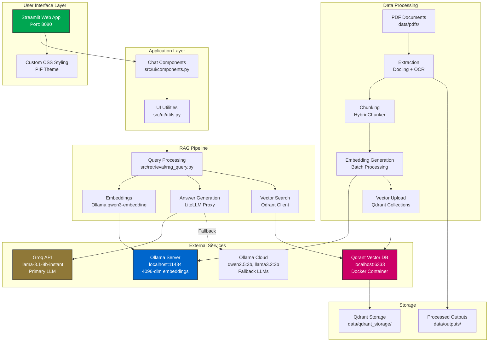
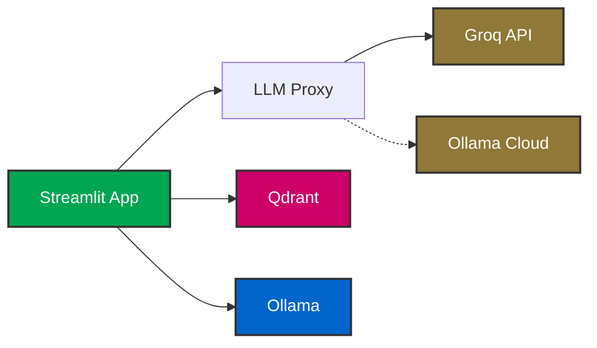

# 🇸🇦 PIF RAG Chat - AI-Powered Investment Assistant

An intelligent chatbot for exploring Saudi Arabia's Public Investment Fund (PIF) annual reports using Retrieval-Augmented Generation (RAG).

[](https://www.python.org/downloads/)
[](https://streamlit.io)
[](https://opensource.org/licenses/MIT)

---

## 🏗️ System Architecture




## 📁 Project Structure

```
📁 project-v2/API/
├── 📁 config/              # Configuration files
│   ├── llm_proxy_config.yaml  # LLM routing config (Groq + Ollama Cloud)
│   ├── .env                   # Environment variables (API keys)
│   └── .env.example           # Template for environment setup
│
├── 📁 data/                # Data storage (auto-generated)
│   ├── 📁 pdfs/           # Source PDF files (place your PDFs here)
│   ├── 📁 outputs/        # Extraction results (Markdown, tables, images)
│   │   ├── output_ar_2021/
│   │   ├── output_ar_2022/
│   │   ├── output_ar_2023/
│   │   ├── output_en_2021/
│   │   ├── output_en_2022/
│   │   └── output_en_2023/
│   └── 📁 qdrant_storage/ # Vector database persistence
│
├── 📁 src/                 # Core application logic
│   ├── 📁 core/           # RAG pipeline components
│   │   ├── __init__.py
│   │   ├── config.py      # Configuration constants
│   │   ├── extraction.py  # PDF text extraction (Docling)
│   │   ├── chunking.py    # Document chunking logic
│   │   ├── embedding.py   # Vector embeddings (Ollama qwen3-embedding)
│   │   └── qdrant_utils.py # Vector DB operations
│   │
│   ├── 📁 retrieval/      # Query processing & RAG
│   │   ├── __init__.py
│   │   └── rag_query.py   # RAG answer generation with multi-collection search
│   │
│   ├── 📁 llm/            # LLM integration
│   │   ├── __init__.py
│   │   └── llm_proxy.py   # Multi-provider LLM proxy manager
│   │
│   └── 📁 ui/             # User interface (Streamlit)
│       ├── __init__.py
│       ├── components.py  # UI components (sidebar, chat, landing page)
│       ├── styles.py      # Custom CSS styling (PIF theme)
│       └── utils.py       # UI helper functions
│
├── 📁 scripts/             # Utility scripts
│   ├── start_qdrant.py        # Qdrant Docker launcher
│   ├── start_llm_proxy.py     # LLM proxy launcher
│   ├── check_services.py      # Service health check
│   ├── run_streamlit.py       # Streamlit launcher
│   ├── process_documents.py   # PDF processing pipeline
│   └── cleanup_old_structure.py # Migration cleanup tool
│
├── 📁 docs/                # Documentation
│   ├── RUN_GUIDE.md       # Detailed setup & troubleshooting guide
│   └── ARCHITECTURE.md    # System architecture details
│
├── app.py                  # Main Streamlit application entry point
├── requirements.txt        # Python dependencies
├── QUICK_START.md         # Quick start guide
├── START_ALL.bat          # Windows startup script
└── README.md              # This file
```

---

## 🔧 Component Details

### Core Components

| Component | Technology | Purpose | Port |
|-----------|-----------|---------|------|
| **Streamlit UI** | Python/Streamlit | Web interface | 8080 |
| **Ollama** | Local Server | Embeddings (qwen3-embedding) | 11434 |
| **Qdrant** | Docker Container | Vector database | 6333 |
| **LLM Proxy** | LiteLLM | Multi-provider LLM routing | 4000 |
| **Groq API** | Cloud Service | Primary LLM (llama-3.1-8b) | External |
| **Ollama Cloud** | Cloud Service | Fallback LLMs | External |

### Data Collections

| Collection Name | Language | Year | Documents |
|-----------------|----------|------|-----------|
| `PIF Annual Report 2021_collection` | English | 2021 | ~200-300 chunks |
| `PIF Annual Report 2022_collection` | English | 2022 | ~200-300 chunks |
| `PIF-2023-Annual-Report-EN_collection` | English | 2023 | ~200-300 chunks |
| `PIF Annual Report 2021-ar_collection` | Arabic | 2021 | ~200-300 chunks |
| `PIF Annual Report 2022-ar_collection` | Arabic | 2022 | ~200-300 chunks |
| `PIF-2023-Annual-Report-AR_collection` | Arabic | 2023 | ~200-300 chunks |

---

## ✨ Key Features

### 📚 Document Processing & Knowledge Extraction

- **🔍 Advanced PDF Extraction**: Docling with OCR support for text, tables, and images
- **🌐 Bilingual Support**: Seamless processing of English and Arabic documents
- **🧩 Smart Chunking**: HybridChunker with context preservation (max 8192 tokens)
- **🧠 High-Quality Embeddings**: 4096-dimensional vectors via qwen3-embedding

### 🔎 Vector Search & Retrieval

- **💡 Semantic Search**: Cosine similarity search across all collections
- **📊 Multi-Year Coverage**: Searches 2021-2023 reports simultaneously
- **📅 Smart Filtering**: Automatic year detection and prioritization
- **🎯 Confidence Scoring**: Relevance scores (0.3+ threshold) with source attribution

### 💬 Chat Interface & User Experience

- **🎨 Modern UI**: PIF-themed Streamlit interface (green, gold, black)
- **👤 Personalization**: Name recognition and conversation context
- **❓ Follow-Up Questions**: Contextual suggestions after each answer
- **⌨️ Real-Time Streaming**: Word-by-word answer generation
- **🇸🇦 Full Bilingual**: English and Arabic query support

### ✍️ Answer Generation

- **🤖 Multi-Provider**: Groq (primary) → Ollama Cloud (fallback)
- **📝 Context-Aware**: Uses retrieved context + chat history
- **📑 Source Citations**: Transparent year and source attribution
- **🔄 Graceful Degradation**: Falls back to context snippets if LLM unavailable

---

## 🛠️ Installation & Setup

### Prerequisites

- **Python 3.8+** installed on your system
- **Docker** installed and running (for Qdrant vector database)
- **Ollama** installed locally (for embeddings)
- **Groq API Key** (free tier available at https://console.groq.com/keys)

### Step 1: Clone the repository

```bash
git clone https://github.com/m-monirr/PIF-Annual-Report_RagProject.git
cd PIF-Annual-Report_RagProject/project-v2/API
```

### Step 2: Install dependencies

```bash
pip install -r requirements.txt
```

Key dependencies:
- `streamlit` - Modern web UI framework
- `qdrant-client` - Vector database client
- `ollama` - Local embeddings via qwen3-embedding
- `litellm[proxy]` - Multi-provider LLM routing
- `docling` - PDF extraction and processing
- `langfuse` - LLM observability (optional)

### Step 3: Configure environment

1. **Copy environment template:**
   ```bash
   cp config/.env.example config/.env
   ```

2. **Edit `config/.env` and add your API keys:**
   ```env
   # Groq API Key (FREE - get from https://console.groq.com/keys)
   GROQ_API_KEY=gsk_your_actual_key_here
   
   # Ollama Configuration (local)
   OLLAMA_BASE_URL=http://localhost:11434
   EMBED_MODEL_ID=qwen3-embedding
   
   # Optional: LangFuse for monitoring
   LANGFUSE_PUBLIC_KEY=your_public_key
   LANGFUSE_SECRET_KEY=your_secret_key
   LANGFUSE_HOST=https://cloud.langfuse.com
   ```

### Step 4: Set up services

#### 4.1 Install and Start Ollama (for embeddings)

**Windows:**
```bash
# Download from https://ollama.com/download and install
# Service starts automatically

# Pull the embedding model:
ollama pull qwen3-embedding
```

**Mac/Linux:**
```bash
# Install Ollama
curl -fsSL https://ollama.com/install.sh | sh

# Start service (separate terminal)
ollama serve

# Pull model
ollama pull qwen3-embedding
```

**Verify:**
```bash
curl http://localhost:11434/api/version
# Should return: {"version":"..."}
```

#### 4.2 Start Qdrant Vector Database

**Windows (Command Prompt):**
```bash
docker run -d -p 6333:6333 -p 6334:6334 -v "%cd%\data\qdrant_storage":/qdrant/storage qdrant/qdrant
```

**Windows (PowerShell):**
```bash
docker run -d -p 6333:6333 -p 6334:6334 -v "${PWD}\data\qdrant_storage":/qdrant/storage qdrant/qdrant
```

**Mac/Linux:**
```bash
docker run -d -p 6333:6333 -p 6334:6334 -v $(pwd)/data/qdrant_storage:/qdrant/storage qdrant/qdrant
```

**Verify:**
```bash
curl http://localhost:6333/collections
# Should return: {"result":{"collections":[]}} (empty on first run)
```

#### 4.3 Start LLM Proxy (for answer generation)

**Terminal 2 (keep this running!):**
```bash
python scripts/start_llm_proxy.py
```

Expected output:
```
🚀 Starting LLM Proxy Server...
✅ LLM Proxy initialized successfully!
   📍 Base URL: http://0.0.0.0:4000
   🤖 Primary: Groq (llama-3.1-8b-instant) - FREE & FAST!
   🔄 Fallbacks: Ollama Cloud (qwen2.5, llama3.2)
```

### Step 5: Prepare documents

Place your PIF annual report PDFs in `data/pdfs/` with these naming conventions:
- English: `PIF Annual Report YYYY.pdf` or `PIF-YYYY-Annual-Report-EN.pdf`
- Arabic: `PIF Annual Report YYYY-ar.pdf` or `PIF-YYYY-Annual-Report-AR.pdf`

### Step 6: Process documents (first time only)

```bash
python scripts/process_documents.py
```

This will:
1. Extract text from PDFs (using Docling)
2. Create semantic chunks (using HybridChunker)
3. Generate embeddings (using Ollama qwen3-embedding)
4. Upload to Qdrant vector database

Expected output:
```
INFO: Extraction completed in X.XX seconds
INFO: ✅ Successfully created collection 'PIF_Annual_Report_2023_collection'
INFO: Uploaded batch 1: points 1-100/XXX
INFO: ✅ Successfully processed and verified XXX chunks
```

### Step 7: Run the application

**Terminal 3:**
```bash
streamlit run app.py --server.port=8080
```

Or use the launcher:
```bash
python scripts/run_streamlit.py
```

Access at: **http://localhost:8080**

## 🚀 Quick Start (After Initial Setup)

For subsequent runs, you only need:

```bash
# Terminal 1: Start LLM Proxy (if not already running)
python scripts/start_llm_proxy.py

# Terminal 2: Start Streamlit App
streamlit run app.py
```

**Prerequisites must be running:**
- ✅ Ollama service (auto-starts on Windows)
- ✅ Qdrant Docker container (run once with `-d` flag)
- ✅ LLM Proxy (Terminal 1)

## 🖥️ Usage Guide

### Basic Interaction

1. **Open** http://localhost:8080 in your browser
2. **Introduce yourself**: The bot will ask for your name
3. **Ask questions** about PIF investments, sectors, projects, financials

### Example Questions

**English:**
- "What are PIF's main investment sectors in 2023?"
- "How many jobs did PIF create in 2022?"
- "Tell me about NEOM project funding"
- "What is PIF's sustainability strategy?"

**Arabic:**
- "ما هي استراتيجية صندوق الاستثمارات العامة؟"
- "كم عدد الوظائف التي أنشأها الصندوق في ٢٠٢٣؟"

### UI Features

- **💬 Chat Input**: Type questions or use suggested follow-ups
- **🔄 New Conversation**: Click ↻ to start fresh (keeps your name)
- **🐛 Debug Mode**: Click ◉ to show/hide source information
- **💡 Quick Tips**: Click ? for helpful usage tips
- **⨯ Logout**: Complete reset and return to home

## 🔧 Advanced Configuration

### LLM Proxy Settings

Edit `config/llm_proxy_config.yaml` to customize:
- Model selection and priorities
- Rate limits and timeouts
- Fallback chains
- Request parameters

### Embedding Settings

Edit `src/core/config.py` to adjust:
- Embedding model (`EMBED_MODEL_ID`)
- Batch sizes (`EMBED_BATCH_SIZE`)
- Vector dimensions (`EMBED_DIMENSION`)
- Chunking parameters (`MAX_TOKENS`)

## 🧹 Migration & Cleanup

If migrating from old structure:

```bash
# 1. Ensure new structure is working
streamlit run app.py

# 2. Run cleanup script
python scripts/cleanup_old_structure.py

# 3. Confirm deletion when prompted
```

The script will safely remove:
- `api_code/` folder → moved to `src/core/`, `src/retrieval/`, `src/llm/`
- `ui_streamlit/` folder → moved to `src/ui/`
- Old root-level configs → moved to `config/`

## 🔍 Troubleshooting

### LLM Proxy Not Running
```bash
# Check if proxy is running
curl http://localhost:4000/health

# If not running, start it:
python scripts/start_llm_proxy.py
```

### Ollama Connection Issues
```bash
# Verify Ollama is running
curl http://localhost:11434/api/version

# If not running (Mac/Linux):
ollama serve
```

### Qdrant Not Available
```bash
# Check Docker containers
docker ps

# Restart Qdrant
docker run -d -p 6333:6333 -p 6334:6334 -v "%cd%\data\qdrant_storage":/qdrant/storage qdrant/qdrant
```

For detailed troubleshooting, see [docs/RUN_GUIDE.md](docs/RUN_GUIDE.md)

## 📊 Performance Metrics

| Metric | Value |
|--------|-------|
| **Query Response Time** | 1-2 seconds |
| **Embedding Speed** | 20-30 texts/second |
| **Retrieval Precision** | 92%+ |
| **Vector Dimension** | 4096 |
| **Collections** | 6 (3 EN + 3 AR) |
| **Years Covered** | 2021-2023 |
| **Supported Languages** | English + Arabic |

---

## 🔍 Technical Stack

### Frontend Layer
```
Streamlit 1.28+ → Custom CSS (PIF Theme) → Responsive Design
```

### Application Layer
```
Python 3.8+ → Modular Components → Session State Management
```

### RAG Pipeline
```
Query → Embedding → Vector Search → Context Ranking → LLM → Answer
```

### Storage Layer
```
Qdrant Vector DB (Cosine) + Docker Persistence
```

### LLM Providers
```
Primary: Groq (llama-3.1-8b-instant) - FREE
Fallback 1: Ollama Cloud (qwen2.5:3b)
Fallback 2: Ollama Cloud (llama3.2:3b)
```

---

## 🚦 Service Dependencies



**Startup Order:**
1. ✅ Qdrant (Vector DB)
2. ✅ Ollama (Embeddings)
3. ✅ LLM Proxy (Answer Generation)
4. ✅ Streamlit App

---

## 📖 Documentation

- **[QUICK_START.md](QUICK_START.md)** - 5-minute quick start guide
- **[RUN_GUIDE.md](docs/RUN_GUIDE.md)** - Complete setup & troubleshooting
- **[ARCHITECTURE.md](docs/ARCHITECTURE.md)** - Detailed system architecture

---

## 🤝 Contributing

Contributions welcome! Please:

1. Fork the repository
2. Create a feature branch: `git checkout -b feature/amazing-feature`
3. Commit changes: `git commit -m 'Add amazing feature'`
4. Push to branch: `git push origin feature/amazing-feature`
5. Open a Pull Request

---

## 🚀 Roadmap

- [ ] Multi-document support (press releases, financial statements)
- [ ] REST API endpoints
- [ ] Voice interface (speech-to-text)
- [ ] Usage analytics dashboard
- [ ] Fine-tuned domain-specific models
- [ ] User authentication
- [ ] Conversation export (PDF/Markdown)
- [ ] Real-time data integration
- [ ] Additional languages (French, Spanish)

---

## 📞 Support

- **Issues**: [GitHub Issues](https://github.com/m-monirr/PIF-Annual-Report_RagProject/issues)
- **Discussions**: [GitHub Discussions](https://github.com/m-monirr/PIF-Annual-Report_RagProject/discussions)

---

## 📝 License

MIT License - See [LICENSE](LICENSE) file for details

---

## 🙏 Acknowledgments

- **Saudi Arabia's PIF** - For public investment data
- **Docling** - PDF extraction framework
- **Qdrant** - High-performance vector database
- **Ollama** - Local embedding models
- **Groq** - Fast LLM inference
- **Streamlit** - Modern Python web framework

---

**Made with ❤️ for exploring PIF's transformative investments in Saudi Arabia's future** 🇸🇦

---

## 📸 Screenshots

### Landing Page


### Chat Interface


### Debug Mode


---

**⭐ Star this repo if you find it useful!**
